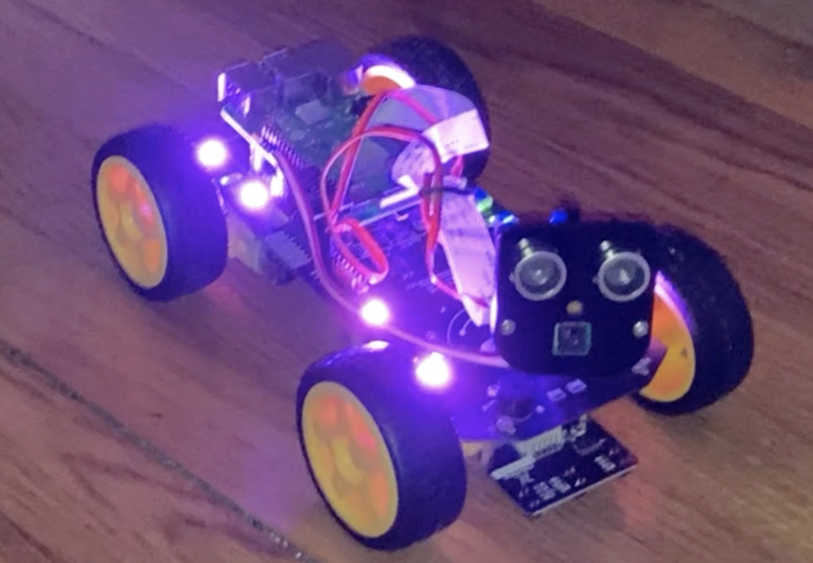

# Voiture Robotique Raspberry Pi

Une voiture robotique intelligente basée sur le kit Freenove FNK0043, contrôlable à distance avec Raspberry Pi. Ce projet combine robotique et IoT pour créer un véhicule avec contrôle web, suivi de ligne et évitement d'obstacles.

## Aperçu du Projet

Ce projet utilise le kit complet Freenove FNK0043 pour construire une voiture robotique équipée d'un Raspberry Pi. La voiture peut être contrôlée à distance via WiFi, dispose de multiples modes de fonctionnement (manuel, automatique, suivi de ligne) et intègre divers capteurs pour une navigation intelligente.

## Fonctionnalités

### Modes de Fonctionnement
- **Contrôle manuel WiFi** - Pilotage via interface web depuis smartphone/ordinateur
- **Suivi de ligne automatique** - Suivi de parcours avec capteurs infrarouges
- **Évitement d'obstacles** - Navigation autonome avec capteurs à ultrasons
- **Contrôle par infrarouge** - Télécommande IR incluse dans le kit
- **Détection de luminosité** - Réaction à la lumière ambiante

### Caractéristiques Techniques
- **Streaming vidéo en direct** - Caméra pour vision en temps réel
- **Capteurs multiples** - 3 capteurs de ligne, 2 capteurs à ultrasons
- **LEDs RGB programmables** - Éclairage et indications visuelles
- **Moteurs à engrenages** - Contrôle précis de la vitesse et direction
- **Alimentation intégrée** - Batterie rechargeable incluse

## Matériel (Kit Freenove FNK0043)

| Composant | Quantité | Rôle |
|-----------|----------|------|
| Raspberry Pi (non inclus) | 1 | Cerveau de contrôle |
| Châssis voiture 4WD | 1 | Structure principale |
| Moteurs à engrenages | 4 | Propulsion des roues |
| Driver moteur TB6612FNG | 1 | Contrôle des moteurs |
| Caméra Raspberry Pi | 1 | Vision et streaming |
| Capteurs à ultrasons HC-SR04 | 2 | Détection d'obstacles |
| Capteurs de suivi de ligne | 3 | Détection de ligne noire |
| Récepteur infrarouge | 1 | Contrôle par télécommande |
| Télécommande IR | 1 | Contrôle manuel sans WiFi |
| Module de suivi de lumière | 1 | Détection de lumière |
| LEDs adressables WS2812 | 4 | Éclairage RGB |
| Batterie 18650 + support | 1 | Alimentation mobile |
| Carte d'extension GPIO | 1 | Connexions simplifiées |

## Branchements GPIO

```
# Moteurs (via TB6612FNG)
Moteur AIN1 → GPIO 27
Moteur AIN2 → GPIO 17
Moteur BIN1 → GPIO 24
Moteur BIN2 → GPIO 23
PWM A → GPIO 18
PWM B → GPIO 13

# Capteurs à ultrasons
Ultrason Avant TRIG → GPIO 20
Ultrason Avant ECHO → GPIO 21
Ultrason Arrière TRIG → GPIO 26
Ultrason Arrière ECHO → GPIO 19

# Capteurs de ligne
Ligne Gauche → GPIO 3
Ligne Centre → GPIO 4
Ligne Droit → GPIO 5

# Caméra → Port CSI
# LEDs WS2812 → GPIO 10
```

### Interface Web
1. Connecter le Raspberry Pi au WiFi
2. Noter l'adresse IP affichée
3. Sur smartphone/ordinateur : ouvrir `http://[adresse-ip]:5000`
4. Utiliser l'interface de contrôle


## Projet Scolaire - Non partageable

Ce projet a été développé dans le cadre du cours d'objets connectés en utilisant le kit Freenove FNK0043.
Le code source n'est pas disponible pour des raisons académiques.

## Démonstration

### Fonctionnalités
*Démonstration des trois modes principaux : Contrôle manuel → Suivi de ligne → Évitement d'obstacles*

### Galerie
<div align="center">
  
</div>

## Ressources
- **Tutoriels vidéo** : [Chaîne YouTube Freenove](https://www.youtube.com/@Freenove)
- **Schémas de câblage** : Inclus dans la documentation du kit

## Auteur
**Raj Beghum Hanif**  
Projet académique - Cours d'objets connectés  
Utilisation du kit Freenove FNK0043

---

*Note : Ce projet éducatif met en pratique les concepts de robotique, systèmes embarqués et programmation Python avec un kit complet pré-conçu.*